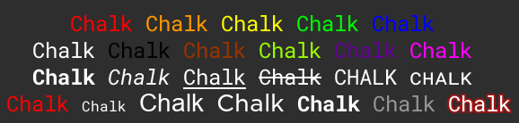
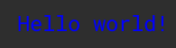
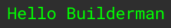

<h1 align="center">
	<br>
	<br>
	
	<br>
	<br>
	<br>
</h1>

<h1 align="center">
    🖍 Rich Text styling done right
    <br>
	<br>
	
	<br>
    <br>
</h1>

## Guide
>[Highlights](#Highlights) <br>
>[Install](#Install) <br>
>[Usage](#Usage) <br>
>[API](#API) <br>
>[Styles](#Styles) <br>
>[Comments](#Comments) <br>
>[Maintainers](#Maintainers) <br>

## Highlights
- Expressive API
- Highly performant
- No dependencies
- Ability to nest styles
- Auto-detects color support
- Clean and focused
- Actively maintained
- Extremely Lightweight (less than ~270 lines)
- Proper Typing for AutoFill

## Install

```lua
-- Run in Roblox Studio Console
local HttpService = game:GetService("HttpService"); 
local ReplicatedStorage = game:GetService("ReplicatedStorage");
local LastValue = HttpService.LastValue

HttpService.HttpEnabled = true

local ChalkModule = Instance.new("ModuleScript");
ChalkModule.Name = "Chalk";
ChalkModule.Parent = ReplicatedStorage;

local Request = HttpService:RequestAsync({
    Url = "https://raw.githubusercontent.com/Perthys/chalk/main/source/main.lua";
    Method = "GET";
});

HttpService.HttpEnabled = LastValue

if Request.Success and Request.StatusCode == 200 then
    ChalkModule.Source = Request.Body

    print("Successfully installed Chalk module. At:", ChalkModule);
else
    error("Failed to install Chalk module.");
end
```

## Usage

**Blue Text Example**
> Chalk has a very simple but powerful API 

```lua
local ReplicatedStorage = game:GetService("ReplicatedStorage");
local Chalk = require(ReplicatedStorage:WaitForChild("Chalk"));

local TextBox = script.Parent;

TextBox.Text = Chalk.blue('Hello world!')
```
<h1 align="left">
	
</h1>

**Multi String Example**
> Chalk comes with an easy to use composable API where you just chain and nest the styles you want.

```lua
local ReplicatedStorage = game:GetService("ReplicatedStorage");
local Chalk = require(ReplicatedStorage:WaitForChild("Chalk"));

local TextBox = script.Parent; TextBox.RichText = true;

local function Update(String) TextBox.Text = String; task.wait(1); end

Update(Chalk.blue("Hello") .. 'World' .. Chalk.red("!"))
Update(Chalk.blue.bold("Hello world!"))
Update(Chalk.blue("Hello", "World!", "Foo", "bar", "biz", "baz"))
Update(Chalk.red("Hello", Chalk.underline("world") .. "!"))
Update(Chalk.green("I am a green line " .. Chalk.blue.underline.bold("with a blue substring") .. " that becomes green again!"))

Update(("CPU: %s \nRAM: %s \nDISK: %s"):format(Chalk.red("90%"), Chalk.green("40%"), Chalk.yellow("70%")))

Update(Chalk.color(123, 45, 67).underline("Underlined reddish color"))
Update(Chalk.color("#DEADED").bold("Bold gray!"))
```
<h1 align="left">
	
</h1>

**Theme Creation**
> Easily define your own themes

```lua
local ReplicatedStorage = game:GetService("ReplicatedStorage");
local Chalk = require(ReplicatedStorage:WaitForChild("Chalk"));

local TextBox = script.Parent; TextBox.RichText = true;

local error = Chalk.bold.red;
local warning = Chalk.color("#FFA500");

local function Update(String) TextBox.Text = String; task.wait(1); end

Update(error("Error!")) 
Update(warning("Warning!"));
```
<h1 align="left">
	
</h1>


Take advantage of string substitution:

```lua
local ReplicatedStorage = game:GetService("ReplicatedStorage");
local Chalk = require(ReplicatedStorage:WaitForChild("Chalk"));

local TextBox = script.Parent; TextBox.RichText = true;

local function Update(String) TextBox.Text = String; task.wait(1); end

local Name = "Builderman";
Update(Chalk.green(("Hello %s"):format(Name)))
```
<h1 align="left">
	
</h1>

## API

### Chalk Syntax and Typing

**Example:**
```lua
chalk[ ArgumentStyle ] -> (...: StyleArgs) -> chalk(...: string)
chalk.size(40)("test");

chalk[ ModifierStyle ] -> chalk(...: string)
chalk.bold("test");

chalk[ ArgumentStyle ] -> (...: StyleArgs) -> chalk[ ArgumentStyle ] -> (...) -> chalk(...: string)
chalk.size(40).color(40,20,30)("test");

chalk[ ArgumentStyle ] -> (...: StyleArgs) -> chalk[ ModifierStyle ] -> chalk(...: string)
chalk.size(40).bold("test");

chalk[ ModifierStyle ] -> chalk[ ModifierStyle ] -> chalk(...: string)
chalk.red.bold("test");

chalk[ ModifierStyle ] -> chalk[ ArgumentStyle ] -> (...: StyleArgs) -> chalk(...: string)
chalk.red.size(40)("test");
```

Chain [styles](#styles) calls the last Style as a method with a string argument.<br />
Order doesn't matter, and earlier Styles take priority in case of a conflict.<br /> 
This simply means that `chalk.red.yellow.green` is equivalent to `chalk.red`.

## Styles

### Modifier Styles
- `Chalk.bold` - Make the text bold
- `Chalk.italic` - Make the text italic
- `Chalk.underline` - Underline the text
- `Chalk.strikethrough` - Strike through the text
- `Chalk.uppercase` - Convert text to uppercase
- `Chalk.smallcaps` - Convert text to small capitals

### Argument Modifier Style
- `Chalk.color(Hex) | Chalk.color(R, G, B) | Chalk.color(Color3.new())` - Set the color
- `Chalk.size([<Size>])` - Set the size of the text (Number)
- `Chalk.face([<Face>])` - Set the typeface of the text (String)
- `Chalk.family([<rbxasset://>])` - Set the font family from an asset (String)
- `Chalk.weight([<Weight>])` - Set the font weight (String)
- `Chalk.transparency([<Transparency>])` - Set the transparency of the text (Number 0-1)
- `Chalk.stroke({Color = [<Color>], Joins = [<Joins>], Thickness = [<Thickness>], Transparency = [<Transparency>]})` - Define stroke properties: color (Color3), joins (String), thickness (Number), and transparency (Number)

```lua
Chalk.stroke({
    Color = [<Color>], 
    Joins = [<Joins>], 
    Thickness = [<Thickness>], 
    Transparency = [<Transparency>]
})
``` 

### Example Game
[`ExampleGame`](https://github.com/Perthys/chalk/raw/main/ExampleGame.rbxl)


### Colors

- `Chalk[<BrickColorName>]` - Set the color to a BrickColor [`Colors`](https://create.roblox.com/docs/reference/engine/datatypes/BrickColor#r)
- `Chalk.white` - Set the color to white
- `Chalk.black` - Set the color to black
- `Chalk.red` - Set the color to red
- `Chalk.brown` - Set the color to brown
- `Chalk.orange` - Set the color to orange
- `Chalk.yellow` - Set the color to yellow
- `Chalk.lime` - Set the color to lime
- `Chalk.green` - Set the color to green
- `Chalk.blue` - Set the color to blue
- `Chalk.purple` - Set the color to purple
- `Chalk.pink` - Set the color to pink
  
## Color3, 256 RGB, Hex and BrickColor support

Chalk supports Color3, 256 RGB, Hex and BrickColor.

Examples:

- `Chalk.color('#DEADED').underline('Hello, world!')`
- `Chalk.color(15, 100, 204)`
- `Chalk.color(Color3.fromRGB(100, 255, 255))`
- `Chalk.nougat`

The following color models can be used:

- [`rgb`](https://en.wikipedia.org/wiki/RGB_color_model) - Example: `chalk.color(255, 136, 0).bold('Orange!')`
- [`hex`](https://en.wikipedia.org/wiki/Web_colors#Hex_triplet) - Example: `chalk.color('#FF8800').bold('Orange!')`
- [`Color3`](https://create.roblox.com/docs/reference/engine/datatypes/Color3) - Example: `chalk.color(Color3.fromRGB(255, 136, 0)).bold("Orange")`
- [`BrickColor`](https://create.roblox.com/docs/reference/engine/datatypes/BrickColor) - Example `chalk["Earth orange"]`


## Origin story
I wanted to make the [`npm package`](https://www.npmjs.com/package/chalk) [`chalk`](https://github.com/chalk/chalk) for roblox luau [`richtext`](https://create.roblox.com/docs/ui/rich-text) because I *really* did not want to do styling manually.

## Comments
- ROBLOX PLEASE ENABLE RICH TEXT TO CONSOLE TEXT OBJECTS, you can make a interface with LogService so print/warn/error can still output raw text.
- If roblox adds support for background text color directly with richtext I will also add support.
- If you have any issues or suggestions best way to contact me would be through discord `Perthys#0`.

## Maintainers

- [Perth](https://github.com/Perthys) | `Perthys#0`
